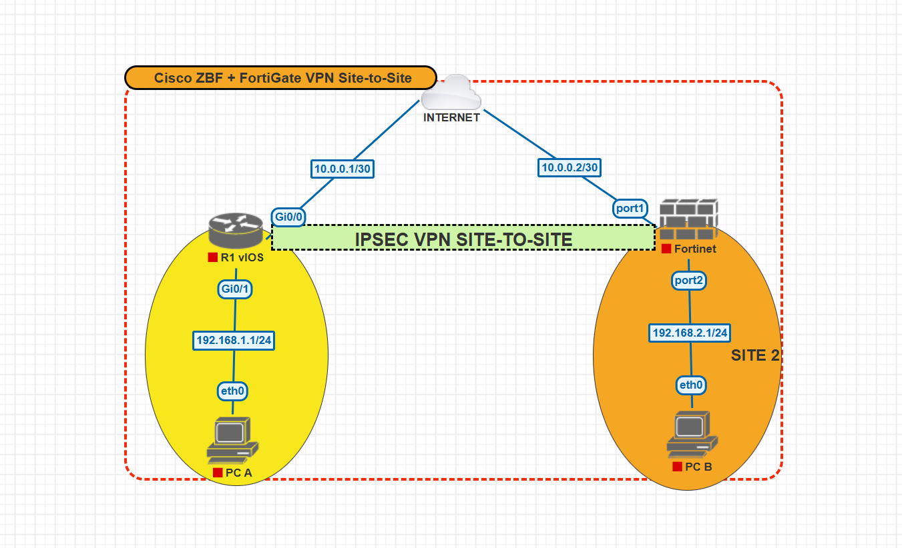

# 🔒 Network Security Lab – Zone-Based Firewall + Site-to-Site VPN

## 🎯 Objectives
- Configure a **Zone-Based Firewall (ZBF)** on a Cisco IOS router.
- Set up an **IPsec Site-to-Site VPN** between Cisco and FortiGate.
- Test and validate inter-site connectivity.

## 📐 Topology

## ⚙️ Equipment / Software
- **Cisco IOSv** – PNETLab
- **FortiGate v6.2.x** – PNETLab
- VMnet8 network for GUI access

## 🛠 Steps
1. Create and assign security zones (INSIDE / OUTSIDE) on Cisco.
2. Configure class-map and policy-map for traffic inspection.
3. Create ACLs for VPN traffic.
4. Set up IPsec Phase 1 and Phase 2 on both Cisco and FortiGate.
5. Validate the VPN tunnel (`show crypto isakmp sa`, `diagnose vpn tunnel list`).
6. Run ping tests between remote LAN networks.

## 📄 Files
- `config_cisco.txt` → Full Cisco router configuration.
- `config_fortigate.txt` → Full FortiGate configuration.
- `test_results.txt` → Connectivity and VPN validation results.

## 📌 Notes
- This lab is built on **PNETLab** using Cisco IOSv and FortiGate KVM images.
- It can also be reproduced in GNS3 with minor adjustments.
